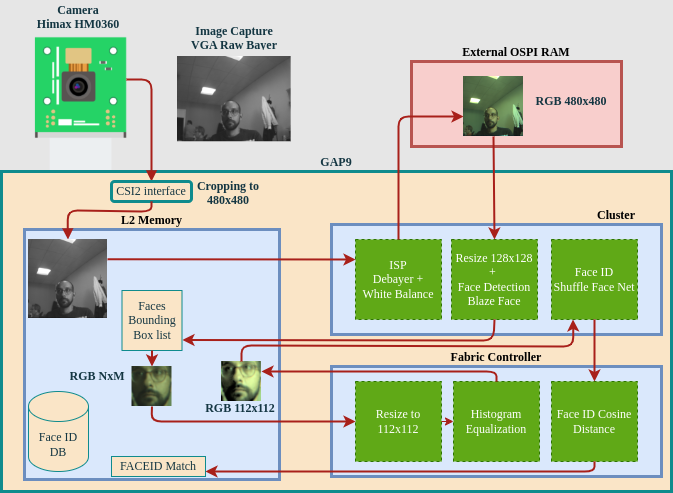

# Face Re-Identification on Gap9

This project shows Face Detection + Face Identification on Gap9. The project is composed of two Neural Networks running on Gap9 and some ISP features. The following picture resumes the full processing:

<p align="center">
  
</p>

To run the project on board you need an HIMAX HM0360 add-on board for the GAP9 EVK, contact Greenwaves through [this form](https://greenwaves-technologies.com/contacts/) to get one. 

## Gap Project Running Modes:

Initialize the build directory and open the cmake menuconfig:

```
# Init cmake build directory, named "build"
cmake -B build
# Configure the application, using build directory "build"
# --> here you can choose running modes and all SDK settigns
cmake --build build --target menuconfig
```

In just opened menuconfig you can follow the following path `FaceID Menu --> Application Mode` to choose between 4 different modes:

1. Only face id Inference Mode : launch the model on specific input images
2. Face Detection + Face Id Inference Mode: launch the 2 models on specific input images
3. Generate Signature of Face with Camera
4. Demo Mode: use the camera

### Mode 1 and 2

The first two modes execute the project with input images from PC. They can be run in GVSOC or board. They are also used to check non-regressions due to SDK and tools updates.

### Mode 3 - Generate Signature of Face with Camera

This mode is meant to be used to generate the signature of a Face. At the beginning of the main file `face_det_id_gen_signature.c` you can find a preprocessor define which handles the number of images used to generate the signature:

```
#define GEN_SIGNATURE_IMAGES 3
```

The result of each face detected in the images is averaged and saved in a binary file on the PC in `signatures/signature.bin`

**Attention: This mode can only be run on target board!**
To select it you can go to menuconfig `GAP_SDK --> Platform` and select board.

### Mode 4 - Demo Mode: use the camera

Demo Mode is meant to run the whole algorithmics. It first loads one or more signatures files from flash that were generated used *Mode 3*. To add or modify the signatures files to load in this mode the following steps should be followed:

1. In the CMakeLists.txt when selecting Mode Demo you have to add this two lines for each file:

```
  	list(APPEND TARGET_PREPROCESSOR -DDB_X=your_signature.bin)
	readfs_add_files(FILES ${CMAKE_CURRENT_SOURCE_DIR}/signatures/your_signature.bin FLASH ${READFS_FLASH})
```

Pay attention since the DB_X variable is the used inside the main file `face_det_id_demo.c` so be coherent with naming. The first lines tell to c code which is the name of the file to be opened in flash. The second line tell to GAPY (Gap9 flasher) to add a file to be written in Flash before the execution. 

2. In the main file `face_det_id_demo.c` you need to modify accordingly to the number of signatures that you want to load the following lines:

```
#define FACE_DB_FILE_NUM 1

char *face_db_files[1] = {
    __XSTR(DB_X),
    // __XSTR(DB_2),
    // __XSTR(DB_3),
    // __XSTR(DB_4)
};
```

`FACE_DB_FILE_NUM` defines the number of signature to be loaded and the strings in the `face_db_files` variable are the file names that you set in the target preprocessor variable in the CMakeLists.txt 

**Attention: This mode can only be run on target board!**
To select it you can go to menuconfig `GAP_SDK --> Platform` and select board.


--------------


Finally to run you can execute this command:

```
# Run the target
cmake --build build --target run
```
