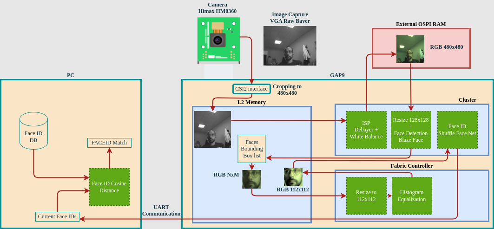

# Face Re-Identification on Gap9

This project shows Face Detection + Face Identification on Gap9. The project is composed of two Neural Networks running on Gap9 and some ISP features. The following picture resumes the full processing:

<p align="center">
  
</p>

To run the project on board you need an HIMAX HM0360 add-on board for the GAP9 EVK, contact Greenwaves through [this form](https://greenwaves-technologies.com/contacts/) to get one. 

## Gap Project Running Modes:

Initialize the build directory and open the cmake menuconfig:

```
# Init cmake build directory, named "build"
cmake -B build
# Configure the application, using build directory "build"
# --> here you can choose running modes and all SDK settigns
cmake --build build --target menuconfig
```

In just opened menuconfig you can follow the following path `FaceID Menu --> Application Mode` to choose between 4 different modes:

1. Only face id Inference Mode : launch the model on specific input images
2. Face Detection + Face Id Inference Mode: launch the 2 models on specific input images
3. Generate Signature of Face with Camera
4. Demo Mode: use the camera

### Mode 1 and 2

The first two modes execute the project with input images from PC. They can be run in GVSOC or board. They are also used to check non-regressions due to SDK and tools updates.

### Mode 3 - Generate Signature of Face with Camera

This mode is meant to be used to generate the signature of a Face. At the beginning of the main file `face_det_id_gen_signature.c` you can find a preprocessor define which handles the number of images used to generate the signature:

```
#define GEN_SIGNATURE_IMAGES 3
```

The result of each face detected in the images is averaged and saved in a binary file on the PC in `signatures/signature.bin`

**Attention: This mode can only be run on target board!**
To select it you can go to menuconfig `GAP_SDK --> Platform` and select board.

### Mode 4 - Demo Mode: use the camera

Demo Mode is meant to run the whole algorithmics as describe in the top image. This mode is made of two applications the gap code and a python pc code to retreive and show the results. To run it you need to have two open shells. The first one where you run the gap9 code with this command:

```
# Run the target
cmake --build build --target run
```

The second one where you run the PC code:
```
python uart_demo_screen.py
```

Pay attention at the beggining on the PC code there is a setting of the UART device name: `UART_DEV='/dev/ttyUSB1'`. You might need to change it depending on your PC connected devices. 

To add people in the database you need to use the mode 3 to create one or more signatures and then rename the generated `.bin` with the person name. The code on Gap will retreive an image, after demosaicing and white balace, run the face detection and then send the face bouding box + the face id signature for each detected face in the image. The PC python code will load all the signature.bin files in the `signatures` folder and try to match it with the signatures received from GAP through the UART. Inside the `uart_demo_screen.py` file you also have a threshold setting `THRESHOLD=0.50` which you can change. This threshold is calcualted as 1 - cosine_distance(each_face_in_database, current_received_signature).

**Attention: This mode can only be run on target board!**
To select it you can go to menuconfig `GAP_SDK --> Platform` and select board.


